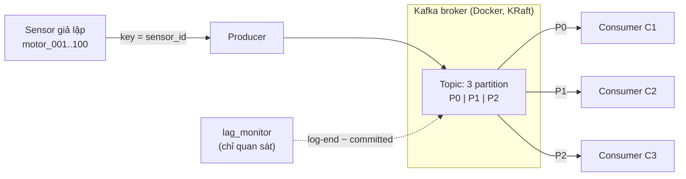

# Apache Kafka cho AIoT: phân tải cảm biến qua Consumer Group (Nhóm 2, MDL26)

Dựng Kafka cục bộ bằng Docker, đẩy dữ liệu cảm biến giả lập vào topic 3 partition, và chứng minh ba consumer cùng một group chia tải, không mất và không trùng bản ghi. Số liệu đo và đối chiếu yêu cầu đề: [REPORT.md](REPORT.md).

## Mục lục

1. [Tổng quan và cách hoạt động](#1-tổng-quan-và-cách-hoạt-động)
2. [Cấu trúc thư mục](#2-cấu-trúc-thư-mục)
3. [Yêu cầu và cài đặt](#3-yêu-cầu-và-cài-đặt)
4. [Kiểm tra nhanh](#4-kiểm-tra-nhanh)
5. [Demo: sensor → partition → consumer](#5-demo-sensor--partition--consumer)
6. [Benchmark và kết quả chính](#6-benchmark)
7. [Kết quả nằm ở đâu](#7-kết-quả-nằm-ở-đâu)
8. [Cấu hình](#8-cấu-hình)
9. [Dọn dẹp](#9-dọn-dẹp)
10. [Xử lý sự cố](#10-xử-lý-sự-cố)
11. [Giới hạn](#11-giới-hạn)
12. [Tuyên bố sử dụng AI](#12-tuyên-bố-sử-dụng-ai-ai-disclosure)

---

## 1. Tổng quan và cách hoạt động



**Luồng dữ liệu.** Producer sinh JSON `{sensor_id, temperature, humidity, voltage, current, timestamp}` cho 100 sensor `motor_001..motor_100` và gửi vào topic với `key = sensor_id`. Ba consumer thuộc cùng một group đọc và kiểm tra schema từng bản ghi.

**Vì sao một sensor chỉ về một consumer.**

1. *Sensor → partition:* partitioner của producer tính `CRC32(sensor_id) % số_partition`. Cùng key thì luôn ra cùng partition, miễn là số partition không đổi. Ví dụ `crc32('motor_001') = 434435839`, chia 3 dư 1, nên `motor_001` luôn vào **Partition 1**.
2. *Partition → consumer:* trong một group, mỗi partition được gán cho đúng một consumer, nên partition 1 do một consumer duy nhất đọc (trong lần đo là C2). Nhiều sensor có thể dùng chung một consumer, nhưng một sensor không bao giờ bị tách ra nhiều consumer.
3. *Thứ tự:* Kafka đảm bảo thứ tự trong từng partition, nên các bản ghi của một sensor luôn được đọc theo đúng thứ tự gửi.

**"Chia đều" nghĩa là gì.** Mỗi consumer nhận một partition. Số message không bằng nhau tuyệt đối vì 100 sensor băm không đều vào 3 partition (đo thật ở T3-r1: 39,1% / 32,9% / 28,0%).

**Điều kiện của tính nhất quán.** Sensor → partition cố định khi số partition không đổi. Partition → consumer cố định khi group ổn định; nếu một consumer rời đi hoặc tham gia thì Kafka *rebalance*: partition chuyển sang consumer khác (vẫn chỉ một consumer tại mỗi thời điểm). Xem demo rebalance ở mục 5.4.

**Độ tin cậy.** Producer bật `enable.idempotence` và `acks=all`. Consumer tự commit offset mỗi giây, nên sau crash có thể đọc lại một phần (at-least-once, không phải exactly-once).

---

## 2. Cấu trúc thư mục

```
aiot-kafka-starter/
├── docker-compose.yml        Kafka 4.2.0 (KRaft, 1 broker); kafka-ui tùy chọn (profile "ui")
├── requirements.txt          confluent-kafka, matplotlib, psutil
├── .env.example              cấu hình mặc định (sao chép thành .env)
├── config/settings.py        đọc .env; biến môi trường được ưu tiên
├── producer/
│   ├── producer.py           gửi theo nhịp --rate, hỗ trợ đột biến (--spike-*), ghi số ACK mỗi giây
│   └── sensor_generator.py   sinh dữ liệu giả lập (không phải mô hình vật lý động cơ)
├── consumer/
│   ├── consumer.py           đọc, kiểm tra, đếm theo giây, ghi sensor_map / offsets / rebalance
│   └── validation.py         kiểm tra schema bản ghi
├── monitoring/
│   ├── run_scenario.py       chạy trọn một lượt benchmark (6 bước)
│   ├── benchmark.py          tính số liệu, vẽ throughput / lag
│   ├── lag_monitor.py        lấy mẫu consumer lag mỗi giây (không join group)
│   ├── resources.py          lấy mẫu CPU/RAM của Kafka (docker stats) và Python (psutil)
│   ├── verify.py             chứng minh không mất, không trùng và chia tải
│   ├── summary.py            gộp các lượt T*-r*/S*-r* thành bảng
│   ├── demo_consistency.py   demo nhiều vòng: sensor luôn về cùng partition/consumer
│   ├── demo_live.py          theo dõi từng message qua 4 chặng
│   ├── demo_routing.py       đối chứng có key / không key
│   ├── demo_rebalance.py     dừng rồi mở lại một consumer khi producer vẫn gửi
│   └── clean.py              dọn output/ và topic/group
├── scripts/                  create_topic.sh, describe_topic.sh
├── results/                  ảnh và CSV kết quả đã chọn đưa vào báo cáo
└── output/                   kết quả từng lượt chạy (không đưa vào Git)
```

---

## 3. Yêu cầu và cài đặt

**Yêu cầu:** Docker Desktop (hoặc Docker Engine + Compose v2) **đang chạy**; Python 3.10 trở lên (đã chạy thử trên Python 3.14.4, Windows 11); cổng `9092` còn trống (và `8080` nếu dùng kafka-ui).

**Windows PowerShell**, tại thư mục gốc dự án:

```powershell
python -m venv .venv
.\.venv\Scripts\Activate.ps1
pip install -r requirements.txt
Copy-Item .env.example .env
docker compose up -d
docker compose ps
```

**Linux / macOS / WSL:**

```bash
python3 -m venv .venv
source .venv/bin/activate
pip install -r requirements.txt
cp .env.example .env
docker compose up -d
docker compose ps
```

Đợi `kafka` hiện **healthy** (lần đầu có thể mất 1–2 phút do tải image). Nếu PowerShell chặn kích hoạt venv: `Set-ExecutionPolicy -Scope CurrentUser RemoteSigned`.

> Mọi lệnh `python -m ...` bên dưới chạy tại **thư mục gốc dự án**, sau khi kích hoạt venv (đầu dòng có `(.venv)`).

Muốn xem giao diện web: `docker compose --profile ui up -d`, rồi mở http://localhost:8080. Mặc định tắt để không chiếm CPU khi đo.

---

## 4. Kiểm tra nhanh

```bash
python -m monitoring.run_scenario --run-id smoke01 --rate 100 --consumers 1 --duration 15 --warmup 2
```

Kết quả đúng: chạy đủ 6 bước `[1/6]..[6/6]`, `Send errors / invalid : 0 / 0`, dòng `PASS: no message lost, none read twice.` và `1:1 check: 100/100 sensors ...`. Nếu pass thì Docker, Kafka và các script đều ổn.

---

## 5. Demo: sensor → partition → consumer

Mỗi demo tự tạo topic riêng và tự xóa khi xong. Thứ tự dưới đây phù hợp khi trình bày.

### 5.1. Nhất quán qua nhiều vòng (bắt đầu từ đây)

```bash
python -m monitoring.demo_consistency                 # 30 sensor, 5 vòng, theo dõi motor_001
python -m monitoring.demo_consistency --sensors 100   # 100 sensor: thấy rõ cách chia vào 3 partition
python -m monitoring.demo_consistency --track motor_007 --rounds 8
python -m monitoring.demo_consistency --step          # bấm Enter để đẩy từng vòng
```

Mỗi vòng đẩy một bản ghi của **mỗi** sensor. Màn hình hiển thị:

- bảng gán partition: `P0 ⇒ C1`, `P1 ⇒ C2`, `P2 ⇒ C3`;
- công thức hash của sensor được theo dõi: `crc32('motor_001') = 434435839; % 3 = 1 → Partition 1 → C2`;
- từng vòng: consumer nào nhận những sensor nào (thanh `####`), kèm dòng `layout identical to round 1: YES/NO`;
- ma trận sensor × vòng (mỗi ô là `P1/C2`), hàng nào đổi giá trị sẽ báo `CHANGED`;
- tải theo partition (số message, %, số sensor);
- 5 dòng PASS/FAIL: nhất quán qua các vòng, khớp `crc32 % partitions`, khớp partition broker xác nhận, mỗi partition đúng một consumer, cả 3 partition đều có dữ liệu.

Kết quả lưu ở `output/consistency01/consistency.json`.

### 5.2. Theo dõi từng message

```bash
python -m monitoring.demo_live --step      # bấm Enter trước mỗi message
python -m monitoring.demo_live --no-key    # đối chứng: không đặt key
```

Mỗi message đi qua 4 chặng: **GENERATE** (tạo JSON) → **SEND** (gửi, kèm công thức crc32) → **KAFKA** (lưu ở partition/offset nào) → **CONSUME** (consumer nào đọc, độ trễ). Cuối cùng có bảng sensor / partition / consumer / thứ tự.

### 5.3. Có key và không có key

```bash
python -m monitoring.demo_routing --run-id routing01             # có key: mỗi sensor đúng 1 consumer
python -m monitoring.demo_routing --run-id routing02 --no-key    # không key: sensor bị tản ra nhiều consumer
```

Bảng `Sensor × C1 C2 C3`: có key thì mỗi hàng chỉ một cột có số; không key thì một sensor xuất hiện ở nhiều cột. Ảnh: `output/<run-id>/routing_key.png`.

### 5.4. Rebalance khi consumer dừng (~80 giây)

```bash
python -m monitoring.demo_rebalance --run-id rebal01
python -m monitoring.verify --run-id rebal01 --topic sensor-data-rebal01 --group aiot-group-rebal01
```

Tự động: 3 consumer chạy → dừng C2 → mở lại C2, producer vẫn gửi liên tục (thêm `--crash` để kill đột ngột thay vì Ctrl+C).

| Pha | C1 | C2 | C3 |
|---|---|---|---|
| 1. ổn định | [0] | [1] | [2] |
| 2. C2 dừng | [0, 1] | (dừng) | [2] |
| 3. C2 quay lại | [0] | [1] | [2] |

Partition 1 và các sensor của nó chuyển sang C1 khi C2 dừng, rồi quay về C2. Tại mỗi thời điểm vẫn chỉ một consumer đọc partition đó. Sau crash có thể có một ít bản ghi đọc trùng (at-least-once); `verify` sẽ cho biết số này.

### 5.5. Nhiều terminal (tùy chọn)

Tạo topic một lần, mở 3 terminal consumer (mỗi terminal kích hoạt venv), rồi gửi từ terminal thứ 4:

```bash
docker compose exec kafka /opt/kafka/bin/kafka-topics.sh --bootstrap-server kafka:29092 --create --if-not-exists --topic live-demo --partitions 3 --replication-factor 1
python -m consumer.consumer --id C1 --run-id live-c --topic live-demo --group live-group --verbose
python -m consumer.consumer --id C2 --run-id live-c --topic live-demo --group live-group --verbose
python -m consumer.consumer --id C3 --run-id live-c --topic live-demo --group live-group --verbose
python -m producer.producer --topic live-demo --run-id live-p1 --rate 2 --duration 20 --verbose
```

Đợi cả ba consumer in `ASSIGN` trước khi gửi. Mỗi lần gửi cần `--run-id` mới. Bấm Ctrl+C ở một consumer để xem rebalance.

---

## 6. Benchmark

### 6.1. Các kịch bản

Chạy **lần lượt**, không chạy đồng thời, đóng các ứng dụng nặng khác khi đo. Mỗi lượt mất khoảng 1,5–2,5 phút. Mỗi `--run-id` chỉ dùng một lần; lặp mỗi kịch bản 3 lần bằng `r1`, `r2`, `r3`.

| Tên | Rate | Consumer | Đặc biệt | Mục đích |
|---|---:|---:|---|---|
| T1 | 1.000 | 1 | | Baseline tải thấp |
| T2 | 5.000 | 1 | | Một consumer có chịu nổi 5.000 msg/s? |
| T3 | 5.000 | 3 | | **Yêu cầu đề:** 3 consumer chia tải |
| T4 | 10.000 | 3 | | Cận trên của đề |
| S1 | 1.000, đỉnh 10.000 (giây 20–30) | 1 | `--delay-ms 0.2` | Tải đột biến, một consumer chậm |
| S3 | như S1 | 3 | `--delay-ms 0.2` | Cùng tải đột biến, ba consumer |

Cách đọc tên: **T** = Throughput test, **S** = Spike test (đột biến); số cuối là số consumer; `-r1` là lần lặp thứ nhất. Topic luôn có 3 partition.

```bash
python -m monitoring.run_scenario --run-id smoke01 --rate 100 --consumers 1 --duration 15 --warmup 2
python -m monitoring.run_scenario --run-id T1-r1 --rate 1000 --consumers 1 --duration 60
python -m monitoring.run_scenario --run-id T2-r1 --rate 5000 --consumers 1 --duration 60
python -m monitoring.run_scenario --run-id T3-r1 --rate 5000 --consumers 3 --duration 60
python -m monitoring.run_scenario --run-id T4-r1 --rate 10000 --consumers 3 --duration 60
python -m monitoring.run_scenario --run-id S1-r1 --rate 1000 --spike-rate 10000 --spike-start 20 --spike-duration 10 --consumers 1 --duration 60 --delay-ms 0.2 --drain-timeout 240
python -m monitoring.run_scenario --run-id S3-r1 --rate 1000 --spike-rate 10000 --spike-start 20 --spike-duration 10 --consumers 3 --duration 60 --delay-ms 0.2 --drain-timeout 240
python -m monitoring.summary
```

### 6.2. Tham số của `run_scenario`

| Tham số | Ý nghĩa | Mặc định |
|---|---|---|
| `--run-id` | Tên lượt chạy (bắt buộc, dùng một lần) | |
| `--rate` | Số message/giây mục tiêu (bắt buộc) | |
| `--consumers` | Số consumer cùng group (bắt buộc) | |
| `--duration` | Số giây producer gửi | 60 |
| `--warmup` | Số giây đầu bị bỏ khi tính số liệu | 5 |
| `--spike-rate`, `--spike-start`, `--spike-duration` | Tăng lên X msg/s từ giây Y trong Z giây | tắt |
| `--delay-ms` | Làm consumer chậm có chủ đích, mỗi message | 0 |
| `--drain-timeout` | Chờ tối đa bao lâu để đọc hết backlog | 120 |
| `--seed` | Seed sinh dữ liệu | 42 |

### 6.3. Một lượt chạy diễn ra thế nào

1. Tạo topic `bench-<run-id>` (3 partition) và group `grp-<run-id>`.
2. Khởi động N consumer, chờ Kafka gán partition xong, nghỉ 3 giây cho rebalance ổn định.
3. Bật `lag_monitor` và bộ lấy mẫu CPU/RAM, rồi bật producer; in lag mỗi giây.
4. Producer xong thì chờ lag về 0 (drain).
5. Dừng consumer và monitor.
6. Tổng kết: CSV, biểu đồ, kiểm tra mất/trùng (`verify`), kiểm tra 1:1 sensor → consumer.

### 6.4. Các thông số trong kết quả

| Thông số | Nghĩa |
|---|---|
| Producer (msg/s) | Số bản ghi broker **xác nhận (ACK)** mỗi giây, trong cửa sổ đo (sau warmup) |
| Consumer (msg/s) | Tổng lượt xử lý hợp lệ của mọi consumer mỗi giây |
| Max lag | Cực đại của tổng (log-end offset − offset đã commit), lấy mẫu mỗi giây |
| Drain (s) | Sau khi producer dừng, mất bao lâu để lag về 0 |
| Lỗi gửi | Số lỗi giao hàng của producer, phải bằng 0 |
| Kafka CPU/RAM | Từ `docker stats`; 100% = 1 nhân; RAM có cả cache |
| Python CPU/RAM | Tổng producer + consumer + monitor |
| Missing / Duplicates | Phải bằng 0 khi không có crash |

Lag đo theo offset **đã commit** và consumer commit mỗi 1 giây, nên Max lag ở T1/T2/T4 (cỡ 1 giây tải) chủ yếu phản ánh chu kỳ commit chứ không phải backlog tích tụ.

### 6.5. Kết quả benchmark chính

Đo ngày 02/10/2026 (Windows 11, Docker Desktop, Kafka 4.2.0 1 broker, 3 partition, 100 sensor). Trung bình 3 lần lặp (S1/S3: 1 lần). Chi tiết, min–max và nhận xét: [REPORT.md](REPORT.md); số gốc từng lượt: [results/all_runs.csv](results/all_runs.csv).

| | Rate mục tiêu | Consumer | Producer (msg/s) | Consumer (msg/s) | Max lag | Drain (s) | Lỗi gửi |
|---|---:|---:|---:|---:|---:|---:|---:|
| T1 | 1.000 | 1 | 1.000 | 999 | 1.122 | 1 | 0 |
| T2 | 5.000 | 1 | 5.000 | 5.000 | 5.242 | 0–1 | 0 |
| T3 | 5.000 | 3 | 5.000 | 5.002 | 5.318 | 0–1 | 0 |
| T4 | 10.000 | 3 | 10.000 | 9.999 | 9.617 | 0–1 | 0 |
| S1 | 1.000, đỉnh 10.000 | 1 | 2.667 | 1.469 | 83.850 | **44** | 0 |
| S3 | 1.000, đỉnh 10.000 | 3 | 2.667 | 2.666 | 54.173 | **1** | 0 |

Ở S1/S3, tốc độ là trung bình trong cửa sổ đo 54 giây (đã bỏ 5 giây warmup tải thấp) nên cao hơn trung bình cả lượt 2.500 msg/s.

**Chia tải giữa 3 consumer (T3-r1):** mỗi consumer giữ đúng một partition, không mất và không trùng.

| Consumer | Partition | Số message | Tỷ lệ | Số sensor | Mất | Trùng |
|---|---|---:|---:|---:|---:|---:|
| C1 | 0 | 117.391 | 39,1% | 39 | 0 | 0 |
| C2 | 1 | 98.638 | 32,9% | 33 | 0 | 0 |
| C3 | 2 | 83.969 | 28,0% | 28 | 0 | 0 |

**Kết luận chính:**

- Producer đạt đúng 1.000, 5.000 và 10.000 msg/s, 0 lỗi gửi; consumer theo kịp (≥ 99,9% mục tiêu).
- **Không mất, không trùng** ở cả 14 lượt; **1:1** ở cả 14 lượt: 100/100 sensor chỉ do đúng một consumer xử lý.
- Một consumer đã đủ cho 5.000 msg/s (T2), nên T3 không nhanh hơn T2. Thêm consumer chỉ có ích khi consumer là điểm nghẽn: khi tải tăng đột biến và xử lý chậm, 1 consumer mất 44 giây để đọc hết backlog còn 3 consumer chỉ mất khoảng 1 giây, với lag đỉnh thấp hơn (54.173 so với 83.850).
- Tải chia theo partition 39% / 33% / 28%, tỉ lệ bận nhất/nhàn nhất khoảng 1,40: không đều tuyệt đối vì 100 sensor được băm vào 3 partition (seed cố định nên gần như giống nhau ở các lần lặp).
- Max lag ở T1, T2, T4 chỉ khoảng 1 giây tải vì lag đo theo offset đã commit và consumer commit mỗi 1 giây; đó là chu kỳ commit chứ không phải backlog tích tụ.
- Kafka dùng khoảng 94–120% của một nhân và ~1,2–1,3 GB RAM (có cache); Python (producer + consumer + monitor) 32–98% CPU, 92–183 MB RAM.

Biểu đồ (trong [results/](results/)): `T4-r1_throughput.png`, `T3-r1_distribution.png`, `S1-r1_consumer_lag.png`, `S3-r1_consumer_lag.png`.


---

## 7. Kết quả nằm ở đâu

Mỗi lượt lưu trong `output/<run-id>/`; `summary` ghi thêm `output/summary.csv`.

| File | Nội dung |
|---|---|
| `benchmark_results.csv` | Một dòng số liệu của lượt |
| `throughput.png`, `consumer_lag.png`, `resources.png` | Biểu đồ thông lượng, lag, CPU/RAM |
| `distribution.png`, `verify.json` | Tải theo consumer/partition, kết quả mất/trùng |
| `sensor_map_C*.json` | Sensor nào đến từ partition nào ở consumer nào (bằng chứng 1:1) |
| `rebalance_C*.jsonl` | Nhật ký assign/revoke của từng consumer |
| `producer_stats.json`, `producer_metrics.csv`, `lag.csv`, `C*.log` | Chi tiết producer, lag từng giây, log consumer |
| `consistency.json`, `routing_*.json/png`, `live_trace.jsonl` | Kết quả các demo |

Thư mục `output/` không được đưa vào Git. Các ảnh và CSV đã chọn cho báo cáo nằm trong [results/](results/).

---

## 8. Cấu hình

Sao chép `.env.example` thành `.env` để thay đổi. Biến môi trường của hệ điều hành được ưu tiên hơn `.env`.

| Biến | Mặc định | Ghi chú |
|---|---|---|
| `KAFKA_BOOTSTRAP_SERVERS` | `localhost:9092` | |
| `KAFKA_TOPIC` | `sensor-data` | Dùng cho chế độ nhiều terminal |
| `KAFKA_PARTITIONS` | `3` | Phải khớp số partition của topic |
| `KAFKA_CONSUMER_GROUP` | `aiot-group` | |
| `PRODUCER_RATE`, `PRODUCER_DURATION` | `5000`, `60` | |
| `NUM_SENSORS` | `100` | `motor_001..motor_100` |

Producer dùng: `acks=all`, idempotence, `linger.ms=5`, nén `lz4`. Consumer: `auto.offset.reset=earliest`, commit mỗi 1 giây.

---

## 9. Dọn dẹp

```bash
python -m monitoring.clean              # xóa output/
python -m monitoring.clean --kafka      # xóa thêm topic bench-*, routing-*, sensor-data-* và MỌI consumer group
python -m monitoring.clean --hard       # xóa toàn bộ dữ liệu Kafka (docker compose down -v)
docker compose down                     # chỉ tắt Kafka, giữ dữ liệu
```

`clean` xóa cả `output/`, tức mất hết kết quả đo; hãy sao lưu trước nếu cần. Thêm `--yes` để bỏ qua câu hỏi xác nhận.

---

## 10. Xử lý sự cố

| Triệu chứng | Cách xử lý |
|---|---|
| `failed to connect to the docker API` | Docker chưa chạy. Mở Docker Desktop, đợi sẵn sàng. |
| `Timeout: ... assigning partitions` | Kafka chưa healthy: `docker compose ps`, đợi rồi chạy lại. |
| `already has data. Use a new --run-id` | Đổi `--run-id`, hoặc xóa `output/<run-id>`. |
| `Topic ... already exists` | Lượt trước bị ngắt giữa chừng: chạy `python -m monitoring.clean --kafka` hoặc đổi `--run-id`. |
| `No module named ...` | Chưa ở thư mục gốc dự án hoặc chưa kích hoạt venv. |
| `Connect to ipv6#[::1]:9092` | Đã xử lý bằng `broker.address.family=v4`; nếu vẫn gặp, kiểm tra cổng 9092 có bị chương trình khác chiếm không. |
| Kết quả dao động mạnh | Đóng ứng dụng nặng, không chạy hai lượt cùng lúc, chạy lặp r1–r3. |

---

## 11. Giới hạn

- Một broker, replication factor 1: chứng minh được chịu lỗi ở mức **consumer** (rebalance), **chưa** ở mức broker.
- Consumer đọc lại sau crash có thể xử lý trùng (at-least-once), không phải exactly-once.
- Dữ liệu cảm biến sinh ngẫu nhiên độc lập, không mô phỏng vật lý động cơ.
- Chia tải phụ thuộc hash của key nên không đều tuyệt đối.
- `--delay-ms` chỉ mô phỏng xử lý chậm; `sleep` thực tế phụ thuộc hệ điều hành.
- S1 và S3 chỉ có một lần đo; T4 chưa đo với một consumer.
- Kết quả phụ thuộc máy chạy, không so sánh trực tiếp giữa các máy khác nhau.

---

## 12. Tuyên bố sử dụng AI (AI Disclosure)

- **Công cụ AI đã dùng:**
- **Mục đích cụ thể:**
- **Mức độ đóng góp của sinh viên:**
