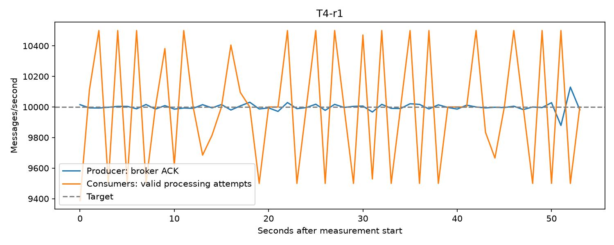
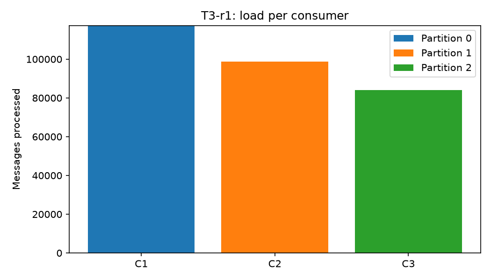
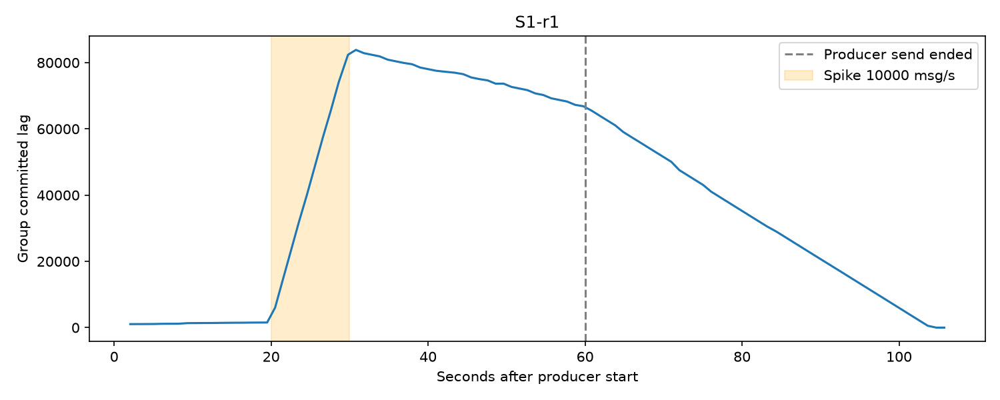
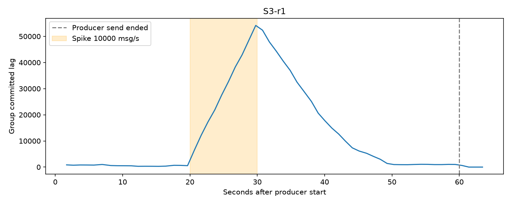

# Báo cáo benchmark: Apache Kafka - Tải sensor request qua Consumer Group (Nhóm 2, MDL26)

Kafka 4.2.0 (1 broker, 3 partition) nhận dữ liệu cảm biến giả lập; 1 hoặc 3 consumer cùng group xử lý. Đo thông lượng (msg/s), consumer lag, CPU/RAM và kiểm tra không mất/không trùng.

## Kịch bản

Số liệu đo lại toàn bộ ngày 02/10/2026 trên một máy. Mỗi lượt gửi 60 giây, bỏ 5 giây đầu khi tính. T1–T4 lặp 3 lần, S1/S3 chạy 1 lần. Dữ liệu: 100 sensor, key = `sensor_id`.

| Kịch bản | Tải gửi | Consumer | Mục đích |
|---|---|---:|---|
| T1 | 1.000 msg/s | 1 | Baseline |
| T2 | 5.000 msg/s | 1 | Một consumer có nghẽn không? |
| T3 | 5.000 msg/s | 3 | Thêm consumer có nhanh hơn không? |
| T4 | 10.000 msg/s | 3 | Mức tải cao nhất của đề |
| S1 / S3 | 1.000 msg/s, tăng lên 10.000 trong giây 20–30 | 1 / 3 | Tải tăng đột biến (consumer chậm giả lập 0,2 ms/message) |

## Cách chạy

Cài đặt và bật Kafka theo [README.md](README.md), rồi:

```bash
python -m monitoring.run_scenario --run-id T3-r1 --rate 5000 --consumers 3 --duration 60
python -m monitoring.run_scenario --run-id S3-r1 --rate 1000 --spike-rate 10000 --spike-start 20 --spike-duration 10 --consumers 3 --duration 60 --delay-ms 0.2 --drain-timeout 240
python -m monitoring.summary
```

Đổi `--rate`, `--consumers` và `--run-id` cho các kịch bản khác. Mỗi lượt tự kiểm tra mất/trùng và lưu kết quả trong `output/<run-id>/`.

## Kết quả

Trung bình 3 lần (S1/S3: 1 lần). Khoảng min–max: [results/summary.csv](results/summary.csv); số gốc từng lượt: [results/all_runs.csv](results/all_runs.csv).

| | Consumer | Producer (msg/s) | Consumer (msg/s) | Max lag | Drain (s) | Kafka CPU / RAM | Python CPU / RAM |
|---|---:|---:|---:|---:|---:|---|---|
| T1 | 1 | 1.000 | 999 | 1.122 | 1 | 94% / 1.232 MB | 32% / 92 MB |
| T2 | 1 | 5.000 | 5.000 | 5.242 | 0–1 | 108% / 1.253 MB | 67% / 93 MB |
| T3 | 3 | 5.000 | 5.002 | 5.318 | 0–1 | 113% / 1.259 MB | 71% / 156 MB |
| T4 | 3 | 10.000 | 9.999 | 9.617 | 0–1 | 120% / 1.270 MB | 98% / 156 MB |
| S1 | 1 | 2.667 | 1.469 | 83.850 | 44 | 74% / 1.340 MB | 32% / 143 MB |
| S3 | 3 | 2.667 | 2.666 | 54.173 | 1 | 85% / 1.338 MB | 60% / 183 MB |

Lỗi gửi: 0 ở mọi lượt. Drain = thời gian đọc hết backlog sau khi producer dừng (`0–1`: giá trị làm tròn khác nhau giữa 3 lần lặp, đều dưới hoặc bằng 1 giây). CPU: 100% = một nhân. Ở S1/S3, tốc độ là trung bình trong cửa sổ đo (đã bỏ 5 giây đầu tải thấp), nên cao hơn trung bình cả lượt 2.500 msg/s.

| Thông số | Nghĩa |
|---|---|
| Consumer (Số lượng Consumer) | Số lượng tiến trình Consumer chạy đồng thời trong cùng một **Consumer Group** để đọc dữ liệu. |
| Producer (msg/s) | Tốc độ đẩy dữ liệu vào Kafka của ứng dụng gửi (số thông điệp/giây). |
| Consumer (msg/s) | Tốc độ đọc và xử lý dữ liệu thực tế từ Kafka của toàn bộ nhóm Consumer (số thông điệp/giây). |
| Max lag (Lượng dữ liệu tồn đọng đỉnh điểm) | Số lượng thông điệp nhiều nhất bị kẹt lại trong Kafka chưa kịp đọc tại thời điểm tải cao nhất. |
| Drain (s) (Thời gian xả đệm - giây) | Thời gian mà nhóm Consumer cần để đọc hết toàn bộ số tin nhắn còn đọng lại trong Kafka **sau khi Producer đã ngừng gửi hẳn**. |
| Kafka CPU / RAM | Mức tiêu thụ tài nguyên phần cứng của máy chủ Kafka Broker. *CPU*: 100% tương đương với việc sử dụng tối đa **1 nhân CPU** (ví dụ: 120% = dùng 1,2 nhân CPU). *RAM*: Dung lượng bộ nhớ đệm Kafka sử dụng (tính bằng MB). |
| Python CPU / RAM | Mức tiêu thụ tài nguyên của ứng dụng Python (chứa code Producer/Consumer client). |

**Kiểm tra mất/trùng:** Missing = 0, Duplicates = 0 ở cả 14 lượt. Kiểm tra 1:1: ở cả 14 lượt, mỗi sensor (100/100) chỉ do đúng một consumer xử lý.

**Chia tải (T3):** mỗi consumer giữ đúng một partition.

| Consumer | Partition | Số message | Tỷ lệ |
|---|---|---:|---:|
| C1 | 0 | 117.391 | 39,1% |
| C2 | 1 | 98.638 | 32,9% |
| C3 | 2 | 83.969 | 28,0% |






## Kết luận

- Producer đạt đúng 1.000, 5.000 và 10.000 msg/s, consumer theo kịp (≥ 99,9%), không lỗi gửi, không mất, không trùng.
- Một consumer đã đủ cho 5.000 msg/s, nên T3 không nhanh hơn T2. Thêm consumer chỉ có ích khi consumer là điểm nghẽn: khi tải tăng đột biến và xử lý chậm, 1 consumer mất 44 giây đọc hết backlog, 3 consumer mất khoảng 1 giây.
- Tải chia theo partition (39% / 33% / 28%), không đều tuyệt đối vì 100 sensor được băm vào 3 partition.
- Max lag ở T1, T2, T4 tương ứng khoảng 1,1; 1,05 và 0,96 giây tải, phù hợp với chu kỳ commit offset 1 giây, không phải backlog tích tụ.

## Giới hạn

- Một broker, replication factor 1: chứng minh được chịu lỗi ở mức consumer, chưa ở mức broker.
- S1/S3 chỉ đo một lần; T4 chưa đo với một consumer; độ trễ consumer là mô phỏng.
- Kết quả phụ thuộc máy chạy.
